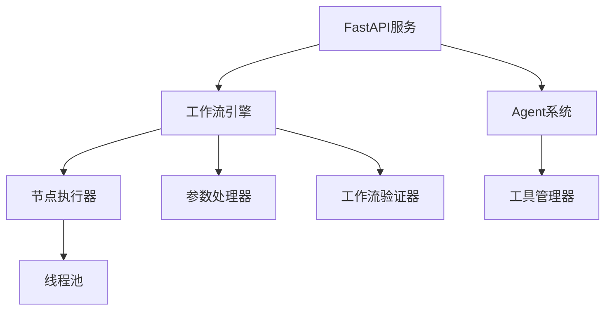

# Awesome Workflow Engine

一个强大而灵活的工作流引擎，支持自然语言处理、Agent模式和实时执行监控，基于Python和FastAPI构建。

## 🌟 特性亮点

- **双模式运行**
  - 工作流模式：基于DAG的可视化工作流执行
  - Agent模式：智能代理自主规划和执行任务
  
- **自然语言处理**
  - 支持通过自然语言描述生成工作流
  - 智能参数解析和上下文理解
  - 自动工作流优化建议

- **实时监控**
  - 基于SSE的实时状态更新
  - 节点执行进度可视化
  - 流式结果输出

- **高度可扩展**
  - 插件化节点系统
  - 丰富的内置节点类型
  - 灵活的回调机制

## 🔍 系统架构

### 核心组件



### 工作流执行流程

1. **工作流定义**：通过JSON配置或自然语言生成
2. **DAG验证**：确保工作流结构的正确性
3. **参数处理**：处理节点间的数据传递
4. **并行执行**：基于依赖关系的节点调度
5. **状态同步**：实时更新执行状态
6. **结果输出**：支持流式输出和最终汇总

## 🛠 内置节点类型

### 数据处理
- `file_read/file_write`: 文件读写操作
- `python_execute`: Python代码执行
- `text_replace`: 文本处理

### 数据库操作
- `db_query`: 数据库查询
- `db_execute`: 数据库执行

### AI & 搜索
- `chat`: LLM对话集成
- `duckduckgo_search`: DuckDuckGo搜索
- `serper_search`: Serper API搜索
- `arxiv_search`: arXiv论文搜索
- `web_crawler`: 网页爬虫

### 系统 & 工具
- `terminal`: 终端命令执行
- `loop_node`: 循环处理
- `api_call`: API调用

## 🚀 快速开始

### 安装

```bash
# 克隆仓库
git clone https://github.com/yourusername/awesome-worflow-engine.git
cd awesome-worflow-engine

# 安装依赖
pip install -r requirements.txt

# 配置环境变量
cp .env.example .env
# 编辑.env文件配置相关参数
```

### 启动服务

```bash
python main.py
```

服务默认启动在 `http://localhost:8000`

## 💡 使用示例

### 1. 工作流模式：新闻搜索与总结

```python
# 通过自然语言创建
curl -X POST http://localhost:8000/chat \
     -H "Content-Type: application/json" \
     -d '{"text": "搜索最近的AI新闻并总结", "model": "workflow"}'

# 或直接定义工作流
{
    "workflow": {
        "nodes": [
            {
                "id": "search",
                "type": "duckduckgo_search",
                "params": {
                    "query": "latest AI developments",
                    "max_results": 5
                }
            },
            {
                "id": "crawl",
                "type": "web_crawler",
                "params": {
                    "urls": "$search.results[*].link"
                }
            },
            {
                "id": "summarize",
                "type": "chat",
                "params": {
                    "system_prompt": "总结以下新闻文章:",
                    "user_input": "$crawl.content"
                }
            }
        ],
        "edges": [
            {"from": "search", "to": "crawl"},
            {"from": "crawl", "to": "summarize"}
        ]
    }
}
```

### 2. Agent模式：自主任务执行

```python
curl -X POST http://localhost:8000/chat \
     -H "Content-Type: application/json" \
     -d '{
           "text": "帮我生成一个关于量子计算最新进展的研究报告",
           "model": "agent",
           "itecount": 5
         }'
```

Agent会自主规划和执行以下步骤：
1. 使用arxiv_search搜索最新论文
2. 使用web_crawler获取补充资料
3. 使用chat节点生成报告
4. 使用file_write保存结果

## 📚 进阶使用

### 自定义节点开发

1. 创建节点类：

```python
from src.nodes.base import BaseNode
from src.core.models import NodeResult
from src.core.enums import NodeStatus

class CustomNode(BaseNode):
    async def execute(self, params: dict) -> AsyncGenerator[NodeResult, None]:
        # 初始状态
        yield NodeResult(
            success=True,
            status=NodeStatus.RUNNING,
            data={"progress": 0}
        )
        
        try:
            # 执行节点逻辑
            result = await self.process_data(params)
            
            # 返回成功结果
            yield NodeResult(
                success=True,
                status=NodeStatus.COMPLETED,
                data=result
            )
        except Exception as e:
            # 返回错误结果
            yield NodeResult(
                success=False,
                status=NodeStatus.FAILED,
                error=str(e)
            )
```

2. 注册节点：

```yaml
# src/nodes/node_config.yaml
CustomNode:
  type: custom_node
  description: "自定义节点"
  params:
    param1:
      type: string
      required: true
    param2:
      type: integer
      default: 10
```

### 工作流最佳实践

1. **参数传递**：使用 `$node_id.field` 语法引用其他节点的输出
2. **错误处理**：为关键节点添加重试机制
3. **并行优化**：合理安排节点依赖，提高执行效率
4. **资源管理**：注意控制并发节点数量

## 🔄 开发计划

### 即将实现
- [ ] 工作流模板系统
- [ ] 分布式执行支持
- [ ] 节点执行超时控制
- [ ] 工作流版本控制

### 持续优化
- [ ] 提升Agent决策能力
- [ ] 增强错误恢复机制
- [ ] 优化Web界面交互
- [ ] 改进自然语言理解

## 📖 API文档

完整的API文档可在服务运行时访问：`http://localhost:8000/docs`

## 🤝 贡献指南

欢迎提交Pull Request！在提交之前请确保：

1. 代码符合项目规范
2. 添加了必要的测试
3. 更新了相关文档

## 📄 开源协议

本项目采用MIT协议 - 详见LICENSE文件
